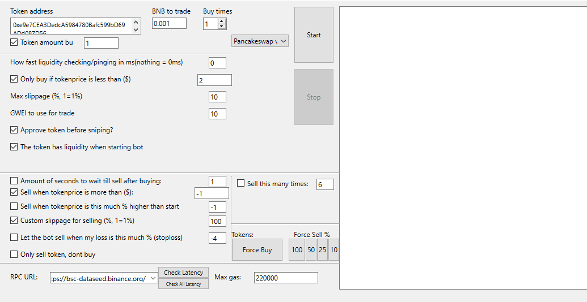

### v2.6 Sniper bot for multiple DEX
Full version sniping bot used to snipe during fair coin launches. With advanced options and a graphical user interface.


<H2>Getting started</H2>

1. Download the latest release from the repository. ```(verify that the downloaded file has a size of around 40mb, otherwise your downloaded file will be corrupt)```
2. Open "usersetting.ini" (with notepad for instance) and add your ethereum/bsc address and private key in the corresponding fields after the equal (=). 
<pre>address=0x0000000000000000000000000000000000000000
privatekey=00000000000000000000000000000000000000000000000000</pre>
**You can get the private key by following this guide: https://metamask.zendesk.com/hc/en-us/articles/360015289632-How-to-Export-an-Account-Private-Key**

3. Run "snipebot.exe" **(To open without problems it is necessary that the files "<a href="./core.exe">core.exe</a>, <a href="./usersetting.ini">usersetting.ini</a> and <a href="./configfile.py">configfile.py</a>" are in the same folder next to snipebot.exe)**

<H2>Functions</H2>

```
~ Token address: Fill the token address of the token you want to trade
(such as 0x0000000000000000000000000000000000000000)
~ BNB to trade: Amount of BNB you want to use in the sniping transaction
```
<H3>Please for more details read the <a href="https://raw.githubusercontent.com/JesusCrypto/windows-full-SnipeBot-pancakeswap-uniswap-pangolin/master/Guidebook.pdf">"Guidebook.pdf"</a></H3>

<H2>Recommendations</H2>

- The test minimum is 0.0001bnb
- Keep in mind latency plays a fundamental role when sniping, I recommend a latency of bellow 250ms, this latency depends on your internet provider, you can minimize it by using a quicknode together with a vps.
- The automatic sale can crash the bot on occasion. an attempt is being made to solve its cause in future updates. My strategy that I usually use for an in fair launcher token is the following:
```
* GWEI: 15
* GAS: 700000
* SLIPPAGE BUY: 40
* SLIPPAGE SELL: 30
* SECOND TO WAIT TILL SELL: 3
* % PROFIT: 200%
* or I deactivate the automatic sale I let the bot buy and sell forced 100%.
```
Note: Other strategies are explained in the guide, however my advice is that you carry out their tests until you find their suitable parameters. 

<H2>Gift a Coffee</H2>
If this bot has been useful to you and you make a nice profits, I would appreciate your donation, and it motivates me to continue offering future support. ;)

**BSC** BEP20 address: 0x24a581330397b0fA45a576b867D0425950B04eF1

## TROUBLESHOOT
there are some reason if your tx failed :
- your gas price are to small
- your GWEI are to small
- your slippage are to small
### -- Please use this node for Matic: `https://matic-mainnet.chainstacklabs.com`
